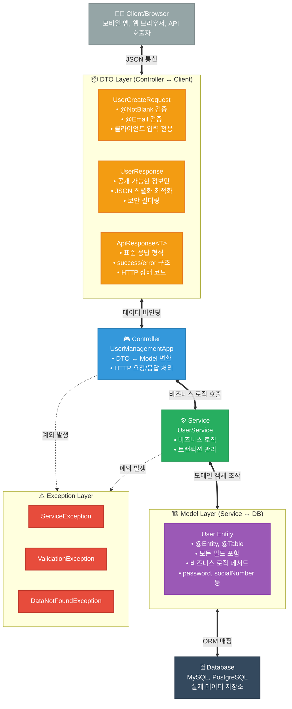
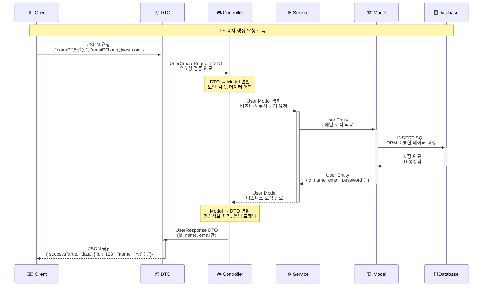
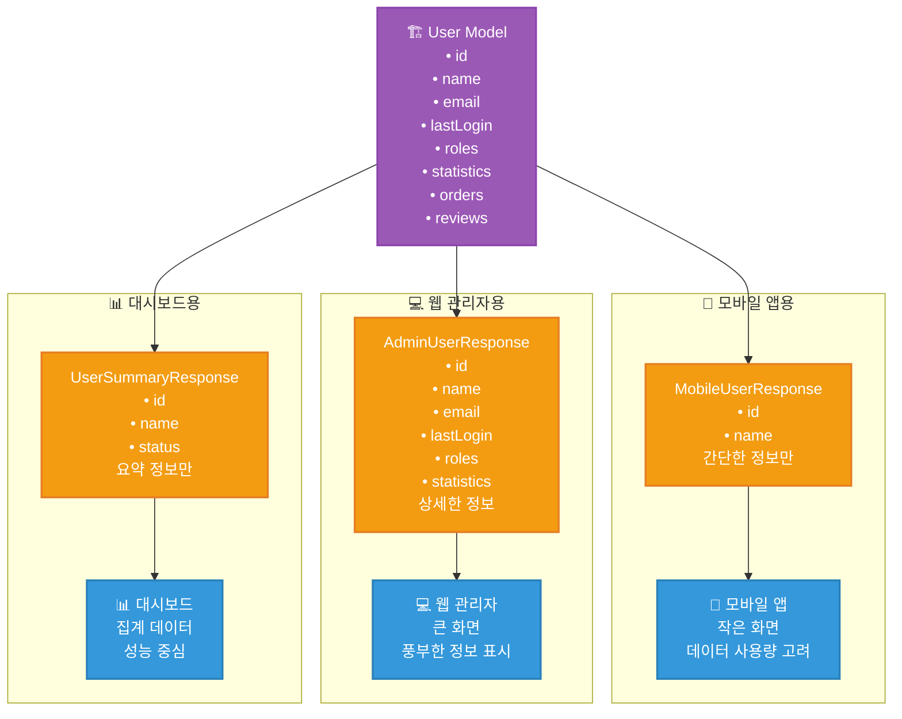
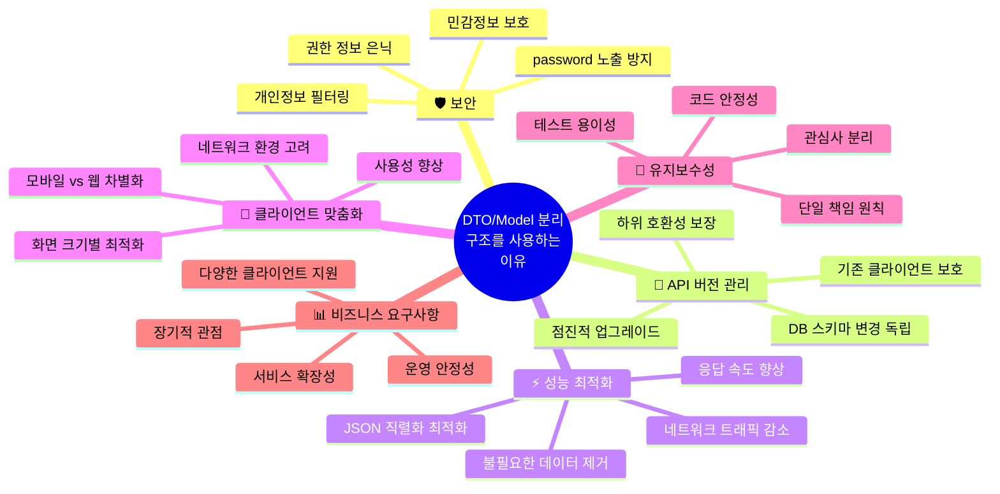
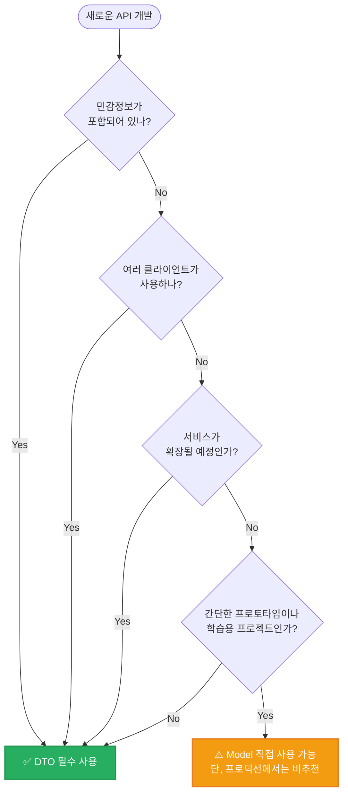

# 🎯 DTO/Model 분리 아키텍처: 왜 이런 구조를 사용하는가?

## 📊 전체 아키텍처 구조



## 🔄 데이터 변환 흐름



## 🛡️ 보안: 가장 중요한 이유

```mermaid
graph LR
    subgraph "❌ DTO 없이 Model 직접 노출"
        Model1[User Entity<br/>• id: user123<br/>• name: 홍길동<br/>• email: hong@test.com<br/>🚨 password: secret123<br/>🚨 socialNumber: 123456-1234567<br/>🚨 isAdmin: true<br/>🚨 lastLoginTime: 2024-01-15]
        JSON1[JSON 응답<br/>모든 민감정보 노출!<br/>{"password": "secret123",<br/>"socialNumber": "123456-1234567",<br/>"isAdmin": true}]
        Model1 --> JSON1
    end
    
    subgraph "✅ DTO로 안전한 정보만 선별"
        Model2[User Entity<br/>• id: user123<br/>• name: 홍길동<br/>• email: hong@test.com<br/>• password: secret123<br/>• socialNumber: 123456-1234567<br/>• isAdmin: true]
        DTO2[UserResponse DTO<br/>• id: user123<br/>• name: 홍길동<br/>• email: hong@test.com<br/>민감정보 제외!]
        JSON2[JSON 응답<br/>안전한 정보만!<br/>{"id": "user123",<br/>"name": "홍길동",<br/>"email": "hong@test.com"}]
        Model2 --> DTO2
        DTO2 --> JSON2
    end
    
    classDef dangerStyle fill:#e74c3c,stroke:#c0392b,stroke-width:2px,color:#fff
    classDef safeStyle fill:#27ae60,stroke:#229954,stroke-width:2px,color:#fff
    
    class Model1,JSON1 dangerStyle
    class Model2,DTO2,JSON2 safeStyle
```

## 🔄 API 버전 관리

```mermaid
graph TD
    subgraph "🎯 Model 변경 상황"
        OldModel[기존 User Model<br/>• id<br/>• name<br/>• email]
        NewModel[변경된 User Model<br/>• userId (id→userId)<br/>• fullName (name→fullName)<br/>• emailAddr (email→emailAddr)]
        OldModel -.->|DB 스키마 변경| NewModel
    end
    
    subgraph "❌ DTO 없이 직접 노출시"
        OldAPI1[기존 API 응답<br/>{"id": "123", "name": "홍길동"}]
        NewAPI1[변경 후 API 응답<br/>{"userId": "123", "fullName": "홍길동"}]
        MobileApp1[📱 모바일 앱<br/>기존 필드명 사용<br/>💥 오류 발생!]
        OldAPI1 -.->|필드명 변경| NewAPI1
        NewAPI1 -.->|호환성 깨짐| MobileApp1
    end
    
    subgraph "✅ DTO로 API 안정성 보장"
        DTO_V1[UserResponse DTO<br/>• id (userId 매핑)<br/>• name (fullName 매핑)<br/>• email (emailAddr 매핑)]
        StableAPI[안정적인 API 응답<br/>{"id": "123", "name": "홍길동"}<br/>기존과 동일한 형식!]
        MobileApp2[📱 모바일 앱<br/>기존대로 동작<br/>✅ 정상 작동!]
        NewModel --> DTO_V1
        DTO_V1 --> StableAPI
        StableAPI --> MobileApp2
    end
    
    classDef problemStyle fill:#e74c3c,stroke:#c0392b,stroke-width:2px,color:#fff
    classDef solutionStyle fill:#27ae60,stroke:#229954,stroke-width:2px,color:#fff
    
    class OldAPI1,NewAPI1,MobileApp1 problemStyle
    class DTO_V1,StableAPI,MobileApp2 solutionStyle
```

## ⚡ 성능 최적화

```mermaid
graph LR
    subgraph "🐌 Model 직접 사용 (느림)"
        HeavyModel[User Entity<br/>• 기본 정보<br/>• orders (100개)<br/>• reviews (200개)<br/>• department 전체 정보<br/>• 연관 데이터 모두 로딩<br/>📊 크기: 500KB]
        SlowNetwork[네트워크 전송<br/>🐌 느린 응답<br/>⏱️ 5초 소요]
        HeavyModel --> SlowNetwork
    end
    
    subgraph "🚀 DTO 사용 (빠름)"
        LightDTO[UserListResponse DTO<br/>• id<br/>• name<br/>• email<br/>불필요한 데이터 제외<br/>📊 크기: 1KB]
        FastNetwork[네트워크 전송<br/>🚀 빠른 응답<br/>⏱️ 0.1초 소요]
        LightDTO --> FastNetwork
    end
    
    classDef slowStyle fill:#e74c3c,stroke:#c0392b,stroke-width:2px,color:#fff
    classDef fastStyle fill:#27ae60,stroke:#229954,stroke-width:2px,color:#fff
    
    class HeavyModel,SlowNetwork slowStyle
    class LightDTO,FastNetwork fastStyle
```

## 📱 클라이언트별 맞춤화



## 🎯 핵심 정리: 왜 이 구조를 사용하는가?



## 📋 실무 체크리스트

### ✅ **언제 DTO를 반드시 사용해야 하는가?**



### 🎓 **취준생을 위한 핵심 포인트**

1. **면접 단골 질문**: "DTO를 왜 사용하시나요?"
   - **답변**: "보안, 성능, API 안정성, 클라이언트 맞춤화를 위해서입니다"

2. **포트폴리오 어필 포인트**:
   - DTO 패턴 적용 → "확장 가능한 아키텍처 설계 능력"
   - Model/DTO 분리 → "보안을 고려한 개발 경험"

3. **실무 준비**:
   - Spring Boot의 `@RequestBody`, `@ResponseBody` 이해
   - Jackson 라이브러리를 통한 JSON 직렬화/역직렬화
   - MapStruct 같은 매핑 라이브러리 활용

> **💡 결론**: 처음엔 복잡해 보이지만, 장기적으로는 더 안전하고 유지보수하기 쉬운 구조입니다!